# Athon — PostgreSQL Database Architecture

## 1. Entity Relationship Diagram

> The ERD is embedded below using Mermaid.js syntax. View with any Mermaid-compatible renderer (GitHub, GitLab, or Mermaid live editor).

**High-level relationship diagram:**

```mermaid
erDiagram
    %% TENANT
    schools  ||--o{ users                   : "tenant has"
    schools  ||--o{ academic_years          : "calendar belongs to"
    schools  ||--o{ teachers                : "employs"
    schools  ||--o{ principals              : "appoints"
    schools  ||--o{ parents                 : "registers"
    schools  ||--o{ classes                 : "creates"
    schools  ||--o{ subjects                : "offers"
    schools  ||--o{ periods                 : "defines"
    schools  ||--o{ students                : "enrolls"
    schools  ||--o{ student_parents         : "tracks"
    schools  ||--o{ class_enrollments       : "manages"
    schools  ||--o{ teacher_class_subjects  : "assigns"
    schools  ||--o{ timetable_entries       : "schedules"
    schools  ||--o{ attendance              : "records"
    schools  ||--o{ homeworks               : "assigns"
    schools  ||--o{ homework_submissions    : "collects"
    schools  ||--o{ tests                   : "schedules"
    schools  ||--o{ test_attempts           : "tracks"
    schools  ||--o{ reports                 : "generates"
    schools  ||--o{ notifications           : "sends"
    schools  ||--o{ audit_logs              : "audits"
    schools  ||--o{ ai_generations          : "logs"
    users    ||--o| teachers                : "is a"
    users    ||--o| principals              : "is a"
    users    ||--o| parents                 : "is a"
    users    ||--o| students                : "is a"
    users    ||--o{ reports                 : "generates"
    users    ||--o{ homework_submissions    : "grades"
    users    ||--o{ test_attempts           : "grades"
    students ||--o{ student_parents         : "has parent"
    students ||--o{ class_enrollments       : "enrolled in"
    students ||--o{ attendance              : "recorded"
    students ||--o{ homework_submissions    : "submits"
    students ||--o{ test_attempts           : "attempts"
    homeworks    ||--o{ homework_questions  : "contains"
    homeworks    ||--o{ homework_submissions : "receives"
    tests        ||--o{ test_questions      : "contains"
    tests        ||--o{ test_attempts       : "taken in"
    notifications ||--o{ notification_recipients : "delivers to"
    academic_terms ||--o{ timetable_entries : "schedules"
    classes     ||--o{ timetable_entries    : "follows"
    subjects    ||--o{ timetable_entries    : "taught in"
    teachers    ||--o{ timetable_entries    : "teaches"
    periods     ||--o{ timetable_entries    : "slots"
```



**ASCII overview:**

```
                        ┌─────────────────────────────────────────────────────────────────────────────────────┐
                        │                                      SCHOOLS                                        │
                        │                 (tenant root; one school has many classes, users,                    │
                        │                        subjects, homework, tests, etc.)                              │
                        └────────┬───────────┬───────────┬──────────────┬──────────────────┬──────────────────┘
                                 │           │           │              │                  │
                     ┌───────────┘   ┌───────┘   ┌───────┘    ┌────────┘                  │
                     ▼               ▼           ▼            ▼                           ▼
               ┌─────────┐    ┌──────────┐ ┌──────────┐ ┌──────────────┐            ┌──────────┐
               │  USERS  │    │ TEACHERS │ │PRINCIPALS│ │ ACADEMIC_    │            │   AI_    │
               │(unified │    │ (1:1     │ │ (1:1     │ │ YEARS        │            │GENERATIONS│
               │  auth)  │    │  user)   │ │  user)   │ └──────┬───────┘            └──────────┘
               └────┬────┘    └─────┬────┘ └──────────┘        │
                    │               │                           │
                    │               │                           ▼
                    │               │                    ┌──────────────┐
                    │               │                    │ ACADEMIC_    │
                    │               │                    │ TERMS        │
                    │               │                    └──────┬───────┘
                    │               ▼                           │
                    │     ┌──────────────────────┐              │
                    │     │ TEACHER_CLASS_       │              │
                    │     │ SUBJECTS (mapping)   │──────────────┘
                    │     └──────┬───────┬───────┘
                    │            │       │
                    │            ▼       ▼
                    │      ┌─────────┐ ┌───────────┐
                    │      │ CLASSES │ │ SUBJECTS  │
                    │      └────┬────┘ └─────┬─────┘
                    │           │             │
                    │           │             │
                    │           ▼             ▼
                    │     ┌────────────────────────┐
                    │     │    TIMETABLE_ENTRIES    │
                    │     │  (unified schedule:    │
                    │     │   class + teacher +    │
                    │     │   subject + day +      │
                    │     │   period)              │
                    │     └───────────┬────────────┘
                    │                 │
                    │                 ▼
                    │           ┌──────────┐
                    │           │ PERIODS  │
                    │           │ (time    │
                    │           │  slots)  │
                    │           └──────────┘
                    │           │
                    ▼           ▼
              ┌────────┐  ┌──────────┐  ┌───────────────────┐
              │STUDENTS│  │ PARENTS  │  │ CLASS_            │
              └───┬────┘  └───┬──────┘  │ ENROLLMENTS      │
                  │           │         └───────────────────┘
                  ▼           ▼
              ┌──────────────┐
              │STUDENT_      │
              │PARENTS (M:N) │
              └──────────────┘

    ┌──────────────────┼───────────────┼───────────┼─────────────────┐
    ▼                  ▼               ▼           ▼                 ▼
┌────────────┐  ┌────────────┐  ┌──────────┐ ┌──────────┐  ┌──────────────┐
│ATTENDANCE  │  │ HOMEWORKS  │  │  TESTS   │ │ REPORTS  │  │NOTIFICATIONS  │
│(daily per  │  │(teacher    │  │(teacher  │ │(progress,│  │(WhatsApp,    │
│ student)   │  │ created)   │  │ created) │ │perf etc) │  │ email, push, │
└────────────┘  └──────┬─────┘  └─────┬────┘ └──────────┘  │ sms)         │
                       │              │                     └──────┬───────┘
                       ▼              ▼                            │
                ┌────────────┐  ┌───────────┐                     ▼
                │ HOMEWORK_  │  │ TEST_     │            ┌──────────────────┐
                │ QUESTIONS  │  │ QUESTIONS │            │ NOTIFICATION_    │
                └────────────┘  └───────────┘            │ RECIPIENTS       │
                       │              │                  └──────────────────┘
                       ▼              ▼
                ┌────────────┐  ┌───────────┐
                │ HOMEWORK_  │  │ TEST_     │
                │ SUBMISSIONS│  │ ATTEMPTS  │
                └──────┬─────┘  └─────┬─────┘
                       │              │
                       ▼              ▼
                ┌────────────┐  ┌───────────┐
                │ HOMEWORK_  │  │  TEST_    │
                │ ANSWERS    │  │  ANSWERS  │
                └────────────┘  └───────────┘
```

## 2. SQL Files — Execution Order

| # | File | Contents | Depends On |
|---|---|---|---|
| 1 | `database/enums.sql` | **11 ENUM types** + `pgcrypto`/`citext` extensions | None |
| 2 | `database/tables.sql` | **29 tables**, **76 FK constraints**, CHECK/UNIQUE constraints | enums.sql |
| 3 | `database/indexes.sql` | **41 indexes** — partial, composite, covering, unique partial | tables.sql |
| 4 | `database/triggers.sql` | **22 `updated_at` triggers** + **10 audit log triggers** on core tables | indexes.sql |
| 5 | `database/rls.sql` | **`app` schema** with 8 helper functions + **RLS on 29 tables** (~90 policies) | triggers.sql |
| 6 | `database/seed.sql` | **Demo school data** — 7 users, 2 classes, 5 subjects, 8 periods, sample timetable | rls.sql |

## 3. Custom ENUM Types

| Enum | Values | Used In |
|---|---|---|
| `user_role` | `super_admin`, `school_admin`, `principal`, `teacher`, `student`, `parent` | `users.role` |
| — | `day_of_week` is SMALLINT with CHECK (1–6), not an ENUM | `timetable_entries.day_of_week` |
| `attendance_status` | `present`, `absent`, `late`, `half_day` | `attendance.status` |
| `question_type` | `multiple_choice`, `true_false`, `short_answer`, `long_answer`, `essay` | `homework_questions.question_type`, `test_questions.question_type` |
| `attempt_status` | `pending`, `in_progress`, `submitted`, `graded`, `results_published` | `homework_submissions.status`, `test_attempts.status` |
| `notification_channel` | `whatsapp`, `email`, `push`, `sms` | `notification_recipients.channel` |
| `enrollment_status` | `active`, `promoted`, `transferred`, `graduated`, `withdrawn` | `class_enrollments.status` |
| `notification_type` | `academic`, `attendance`, `fee_reminder`, `announcement`, `behavioral`, `emergency`, `system`, `other` | `notifications.notification_type` |
| `notification_status` | `pending`, `sent`, `delivered`, `failed` | `notification_recipients.status` |
| `report_type` | `student_progress`, `class_performance`, `teacher_performance`, `attendance_summary`, `exam_results`, `custom` | `reports.report_type` |
| `gender` | `male`, `female`, `other` | `students.gender` |
| `parent_relationship` | `father`, `mother`, `guardian`, `other` | `student_parents.relationship` |

## 4. Entity Summary

| # | Table | PK | School-scoped | Soft Delete | Purpose |
|---|---|---|---|---|---|
| 1 | `academic_years` | UUID | ✅ | ✅ | Academic calendar years per school |
| 2 | `academic_terms` | UUID | ✅ | ✅ | Terms within each academic year |
| 3 | `schools` | UUID | N/A (root) | ✅ | Tenant root entity |
| 4 | `users` | UUID | ✅ | ✅ | Unified auth principal via `supabase_user_id` (no password_hash — Supabase Auth managed) |
| 5 | `teachers` | UUID | ✅ | ✅ | Teacher-specific profile |
| 6 | `principals` | UUID | ✅ | ✅ | Principal-specific profile (first-class role) |
| 7 | `parents` | UUID | ✅ | ✅ | Parent/guardian profile |
| 8 | `classes` | UUID | ✅ | ✅ | Class groups (e.g. "Grade 10-A") |
| 9 | `subjects` | UUID | ✅ | ✅ | Academic subjects offered |
| 10 | `students` | UUID | ✅ | ✅ | Student-specific profile |
| 11 | `student_parents` | UUID | ✅ | ❌ | M:N student↔parent relationships |
| 12 | `class_enrollments` | UUID | ✅ | ❌ | Enrollment history (across years/classes) |
| 13 | `teacher_class_subjects` | UUID | ✅ | ✅ | Maps teachers → classes → subjects per term |
| 14 | `periods` | UUID | ✅ | ✅ | School day time slots (reference data) |
| 15 | `timetable_entries` | UUID | ✅ | ✅ | Unified class & teacher schedule |
| 16 | `attendance` | UUID | ✅ | ❌ | Daily attendance per student |
| 17 | `homeworks` | UUID | ✅ | ✅ | Homework assignments (`version`, `is_published` for draft workflow) |
| 18 | `homework_questions` | UUID | ✅ (via FK) | ❌ | Questions within a homework (`explanation` for AI feedback support) |
| 19 | `homework_submissions` | UUID | ✅ | ❌ | Student homework submissions |
| 20 | `homework_answers` | UUID | ✅ (via FK) | ❌ | Per-question answers in homework |
| 21 | `tests` | UUID | ✅ | ✅ | Test/exam definitions (`version`, `is_published` for draft workflow) |
| 22 | `test_questions` | UUID | ✅ (via FK) | ❌ | Questions within a test (`explanation` for student review mode) |
| 23 | `test_attempts` | UUID | ✅ | ❌ | Student test attempts |
| 24 | `test_answers` | UUID | ✅ (via FK) | ❌ | Per-question answers in test |
| 25 | `reports` | UUID | ✅ | ❌ | Generated reports (generic — `report_type` enum + `data` JSONB, separate `generated_at` + `created_at`) |
| 26 | `notifications` | UUID | ✅ | ❌ | Outbound notification records (`scheduled_at` for future/delayed delivery) |
| 27 | `notification_recipients` | UUID | ✅ (via FK) | ❌ | Per-recipient delivery tracking with CHECK constraint enforcing exactly one of `user_id` or `parent_id` |
| 28 | `audit_logs` | UUID | ✅ | ❌ (immutable) | Immutable audit trail |
| 29 | `ai_generations` | UUID | ✅ | ❌ (immutable) | AI content generation audit & cost tracking (`generation_type` for faster filtering) |

## 5. Primary Keys

- **Type**: UUID via `gen_random_uuid()`
- **Column name**: `id` on every table
- **Rationale**: Prevents ID enumeration, enables distributed ID generation, avoids sequence contention

## 6. Foreign Keys — Key Decisions

| Source → Target | Rule |
|---|---|
| `students.class_id → classes.id` | Current class (denormalized); canonical history in `class_enrollments` |
| `class_enrollments → students, classes, academic_years` | Full enrollment history per academic year |
| `teacher_class_subjects → teachers, classes, subjects` | A teacher teaches a subject to a class |
| `timetable_entries → periods` | Links schedule entries to time slots |
| `timetable_entries → teachers, classes, subjects, academic_terms` | Unified schedule — who teaches what to whom when |
| `principals → users` (1:1) | First-class role, separate from teachers |
| `classes.class_teacher_id → teachers.id` (nullable) | Optional form teacher |
| `homework_submissions.graded_by → users.id` | Admins, principals, and teachers can grade |
| `test_attempts.graded_by → users.id` | Same flexibility for test grading |
| `attendance.marked_by → teachers.id` | Only teachers mark attendance |
| `student_parents → students, parents` | M:N — student can have multiple parents |
| `notification_recipients → user_id/parent_id` (CHECK) | Exactly one of `user_id` or `parent_id` must be present |
| `homework_questions → homeworks` ON DELETE CASCADE | Deleting homework removes its questions |
| `test_questions → tests` ON DELETE CASCADE | Deleting test removes its questions |

Constraint naming: `{child_table}_{column}_fk` (e.g. `homeworks_teacher_fk`).

## 7. Multi-Tenant Strategy

**Architecture**: Shared Database, Shared Schema

- Every tenant-scoped table includes `school_id UUID NOT NULL` referencing `schools(id)`
- RLS policies enforce tenant isolation at the database level
- Application sets session context on each connection:
  ```sql
  SET app.current_school_id = '<uuid>';
  SET app.current_user_id = '<uuid>';
  SET app.current_user_role = 'principal';
  ```

## 8. Row Level Security

Implemented in `database/rls.sql`. Full RLS on all 29 tables with ~90 policies.

**Architecture**:
- **`app` schema** — 8 helper functions for policy evaluation, isolated from the `public` schema
- **Session context** — Application sets `app.current_user_id`, `app.current_school_id`, `app.current_user_role` at connection time; policies use `auth.uid()` as fallback

**Two-layer approach**:
1. **Tenant isolation**: Every policy filters by `school_id = app.current_school_id()`
2. **Role-based access**:

| Role | SELECT | INSERT | UPDATE | DELETE |
|---|---|---|---|---|
| `super_admin` | Bypasses RLS (service_role) | Bypasses RLS | Bypasses RLS | Bypasses RLS |
| `school_admin` | School-wide | School-wide | School-wide | School-wide |
| `principal` | School-wide | Academic structure | School-wide | — |
| `teacher` | Own + assigned classes | Own homeworks/tests/attendance | Own assignments | — |
| `student` | Own records only | Own submissions/attempts | Own | — |
| `parent` | Children's records | — | — | — |

**Key helper functions**:
- `app.current_user_id()` — `auth.uid()` with session fallback
- `app.current_school_id()` — from session or user lookup
- `app.current_user_role()` — from session or user lookup
- `app.user_has_role(VARIADIC)` — multi-role check
- `app.is_parent_of_student()` — parent-child relationship
- `app.is_teacher_of_class()` — teacher-class assignment

## 9. Triggers

Implemented in `database/triggers.sql`. Two categories of triggers:

**Automatic Timestamps (22 triggers)**:
- Generic `set_updated_at()` function sets `updated_at = now()` on every UPDATE
- Applied to all 22 tables with an `updated_at` column
- Tables without `updated_at` (immutable: audit_logs, ai_generations, homework_questions, etc.) have no trigger

**Audit Logging (10 triggers)**:
- Generic `audit_log_changes()` function captures INSERT/UPDATE/DELETE events
- Applied to core business tables: schools, users, teachers, principals, students, classes, homeworks, tests, attendance, timetable_entries
- Reads `app.current_user_id` and `app.current_ip_address` from session settings
- High-volume tables (submissions, attempts, answers, notifications) are excluded to prevent runaway log growth

## 10. Seed Data

Implemented in `database/seed.sql`. Demo data for development and testing:

| Entity | Records | Details |
|---|---|---|
| `schools` | 1 | Athon Demo International School |
| `academic_years` | 1 | 2025-2026 (current) |
| `academic_terms` | 2 | Term 1 (current), Term 2 |
| `users` | 7 | All roles: super_admin, school_admin, principal, teacher, student (×2), parent |
| `teachers` | 1 | Tina Teacher (Mathematics, form teacher Grade 10A) |
| `principals` | 1 | Peter Principal (permanent appointment) |
| `parents` | 1 | Patricia Parent (mother of Sam) |
| `classes` | 2 | Grade 10A & 10B (current academic year) |
| `subjects` | 5 | Math, English, Science, History, Art |
| `students` | 2 | Sam (male) and Sierra (female) |
| `student_parents` | 1 | Sam → Patricia (mother, primary) |
| `class_enrollments` | 2 | Both in Grade 10A, active |
| `teacher_class_subjects` | 1 | Tina → Grade 10A → Math |

All UUIDs use a recognizable `0000...` pattern for easy debugging. `supabase_user_id` values are placeholders — replace with real Supabase Auth IDs.
Sample homework and test data is included but commented out (ready to uncomment when needed).
Wrapped in `BEGIN/COMMIT` for atomic execution.

## 11. Scalability

- **Connection pooling**: PgBouncer in transaction mode
- **Partitioning candidates**: `attendance` (by date), `audit_logs` (by month)
- **Archive strategy**: Soft-deleted records older than one academic year → archive schema
- **JSONB flexibility**: `schools.settings`, `reports.data`, `test_questions.options`, `users.metadata`
- **Built-in audit**: `ai_generations` tracks AI usage/cost; `audit_logs` tracks data changes

## 12. Table Naming Conventions

| Element | Convention | Example |
|---|---|---|
| Table names | Plural `snake_case` | `students`, `teacher_class_subjects` |
| Column names | `snake_case` | `admission_number`, `is_published` |
| Primary keys | `id` | Always `UUID PRIMARY KEY DEFAULT gen_random_uuid()` |
| Foreign keys | `{table_singular}_id` | `school_id`, `class_teacher_id` |
| ENUM types | Descriptive `snake_case` | `attendance_status`, `notification_channel` |
| Index names | `idx_{table}_{column}` | `idx_attendance_class_date` |
| Constraint names | `{table}_{column}_{suffix}` | `_pk`, `_fk`, `_uk`, `_ck` |
| Boolean columns | `is_` or `has_` prefix | `is_active`, `is_published`, `is_graded` |
| Timestamp columns | `_at` suffix | `created_at`, `updated_at`, `deleted_at` |
| Soft delete | `deleted_at TIMESTAMPTZ` | `NULL` = active, non-`NULL` = deleted |
